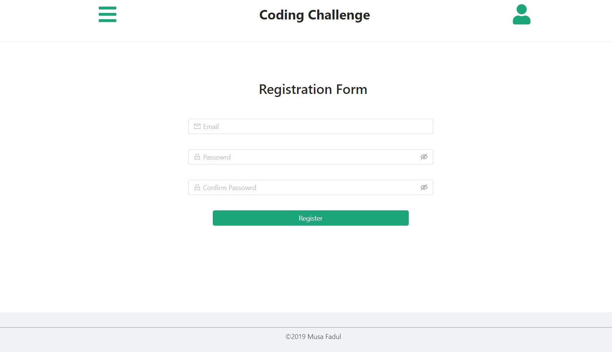

## The project was bootstrapped with [Create React App](https://github.com/facebook/create-react-app).

### `Visit the application OnLine !`
https://musafadul.github.io/SMS-Frontend/

### `Get the application working Locally!`

1- Clone or download the project. 
1- Make sure That npm and create-react-app is installed in your machine globaly. 
1- In the command Prompt Navigate to the propject directory. 
2- Run npm install to install project dependencies. 
3- Run npm start. 
the app will then run in the development mode. 
Open http://localhost:3000 to view it in the browser.

### `App Pages`

